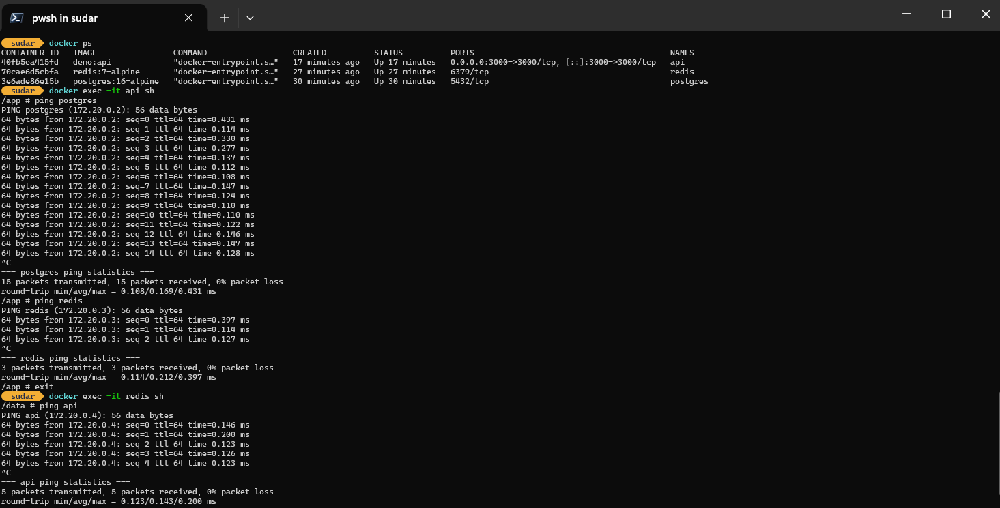
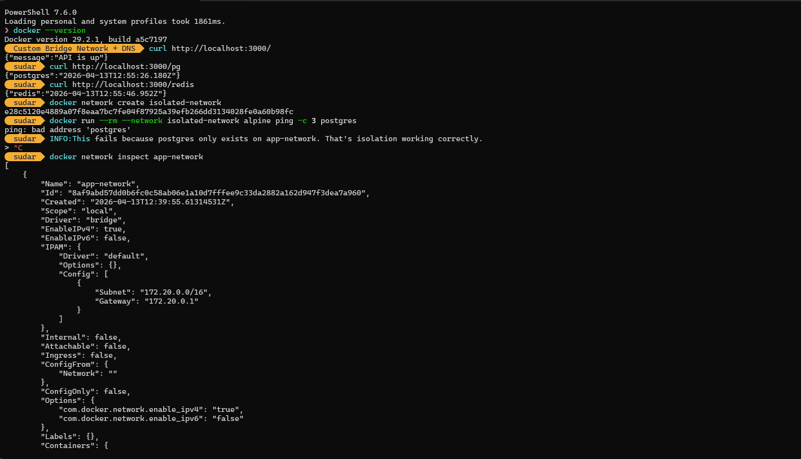

# Project 2 — Custom Bridge Network + DNS

## Motive

Most Docker tutorials jump straight to Compose. This project deliberately avoids it.
The goal is to wire up multiple containers manually using raw `docker network` and `docker run`
commands so you understand what Compose is actually doing under the hood — before letting it do it for you.

Three containers are connected:
- A TypeScript/Express API
- Postgres (database)
- Redis (cache)

No Compose. No shortcuts. Everything done via CLI.

---

## Project Structure

```
network-demo/
├── app/
│   ├── src/
│   │   └── index.ts
│   ├── package.json
│   ├── package-lock.json
│   └── tsconfig.json
├── dockerfiles/
│   └── Dockerfile
└── .dockerignore
```

---

## How It Works

Docker's custom bridge network has a built-in DNS resolver. Every container on the same
custom bridge network can reach other containers using their `--name` as a hostname.

```
                    app-network (172.20.0.0/16)
                 ┌──────────────────────────────┐
                 │                              │
  curl :3000 --> │  api  -->  postgres          │
                 │       -->  redis             │
                 │                              │
                 └──────────────────────────────┘
```

The API container connects to Postgres using `PG_HOST=postgres` and Redis using
`REDIS_HOST=redis` — both are just container names, resolved automatically by Docker DNS.
No hardcoded IPs. No `/etc/hosts` editing. It just works on a custom bridge network.

This does NOT work on the default bridge network — container name DNS is a feature
exclusive to user-defined (custom) bridge networks.

---

## Commands Walkthrough

### 1. Create the network

```powershell
docker network create --driver bridge --subnet 172.20.0.0/16 app-network
```

Creates a custom bridge network with a defined subnet. All three containers will live here.

```powershell
docker network inspect app-network
```

Shows the network config, connected containers, and their assigned IPs.

---

### 2. Start Postgres

```powershell
docker run -d `
  --name postgres `
  --network app-network `
  -e POSTGRES_USER=admin `
  -e POSTGRES_PASSWORD=secret `
  -e POSTGRES_DB=appdb `
  postgres:16-alpine
```

- `--name postgres` — this name becomes the DNS hostname other containers use to reach it
- `-e` flags configure the database via environment variables
- No `-p` flag — Postgres is not exposed to your machine, only reachable inside `app-network`

---

### 3. Start Redis

```powershell
docker run -d `
  --name redis `
  --network app-network `
  redis:7-alpine
```

Same principle — name becomes DNS hostname, not exposed to host machine.

---

### 4. Verify DNS before writing any code

```powershell
docker run --rm --network app-network alpine ping -c 3 postgres
docker run --rm --network app-network alpine ping -c 3 redis
```

Spins up a temporary Alpine container on the same network and pings by container name.
If this works, DNS resolution is confirmed. `--rm` removes the container after it exits.

---

### 5. Build the API image

```powershell
docker build -f dockerfiles/Dockerfile -t demo:api ./app
```

Uses a multistage Dockerfile — Stage 1 compiles TypeScript, Stage 2 runs the output.

---

### 6. Run the API

```powershell
docker run -d `
  --name api `
  --network app-network `
  -p 3000:3000 `
  -e PG_HOST=postgres `
  -e PG_USER=admin `
  -e PG_PASSWORD=secret `
  -e PG_DB=appdb `
  -e REDIS_HOST=redis `
  demo:api
```

- `--network app-network` — joins the same network as Postgres and Redis
- `-p 3000:3000` — only the API is exposed to your machine, the other two are internal
- `-e PG_HOST=postgres` — the value `postgres` is the container name, resolved by Docker DNS

---

### 7. Test the endpoints

```powershell
curl http://localhost:3000/        # API health check
curl http://localhost:3000/pg      # queries Postgres, returns current DB time
curl http://localhost:3000/redis   # writes and reads a value from Redis
```

---

### 8. Test network isolation

```powershell
docker network create isolated-network
docker run --rm --network isolated-network alpine ping -c 3 postgres
```

This fails. `postgres` is on `app-network`, not `isolated-network`. Containers cannot
reach across networks unless explicitly connected to both. This is Docker network
isolation working correctly.

---

### 9. Debug commands

```powershell
# See all containers attached to app-network and their IPs
docker network inspect app-network

# Check logs per container
docker logs api
docker logs postgres
docker logs redis

# Shell into the API container and test DNS manually
docker exec -it api sh
# inside:
ping postgres
ping redis
exit
```

---

### Cleanup

```powershell
docker stop api redis postgres
docker rm api redis postgres
docker network rm app-network isolated-network
```

---

## API Source

`src/index.ts` exposes three routes:

| Route    | What it does                              |
|----------|-------------------------------------------|
| `/`      | Returns `{ message: 'API is up' }`        |
| `/pg`    | Queries `SELECT NOW()` from Postgres      |
| `/redis` | Sets and gets a timestamp key from Redis  |

Container hostnames come from environment variables injected at `docker run` time —
the app has no hardcoded service addresses.

```ts
const pool = new Pool({
  host: process.env.PG_HOST,   // resolves to 'postgres' container
  ...
});

const redisClient = createClient({
  url: `redis://${process.env.REDIS_HOST}:6379`,  // resolves to 'redis' container
});
```

---

## What Was Learned

**Custom bridge vs default bridge**
The default bridge network Docker creates automatically does not support container name DNS.
You must create a user-defined bridge network to get DNS resolution by container name.

**Container name = DNS hostname**
On a custom bridge network, `--name postgres` means any container on the same network
can reach it at hostname `postgres`. Docker runs an internal DNS server that handles this.

**Environment variables at runtime**
Service addresses, credentials, and config are passed via `-e` flags at `docker run` time —
not hardcoded in the image. The same image can point to different databases in different environments.

**Port exposure is selective**
Only the API has `-p 3000:3000`. Postgres and Redis have no `-p` flag — they are
unreachable from your machine but fully accessible to other containers on `app-network`.
This is the correct production pattern — databases should never be exposed to the host.

**Network isolation**
Containers on different networks cannot communicate. A container must be explicitly
connected to a network (via `--network` at run time or `docker network connect`) to
reach services on it.

**What Compose actually does**
Docker Compose automates exactly what was done manually here — creates a network,
starts containers with the right names and env vars, connects them together.
Understanding the manual process makes Compose configs readable and debuggable.

---

## Screenshots



