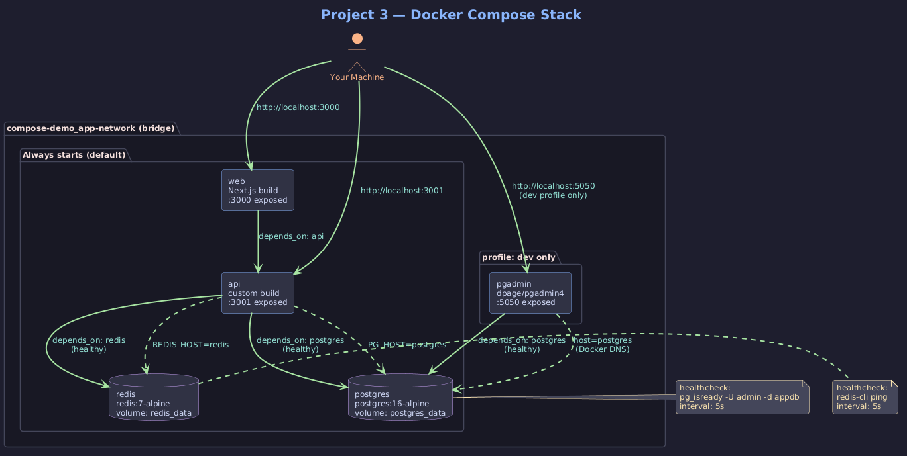
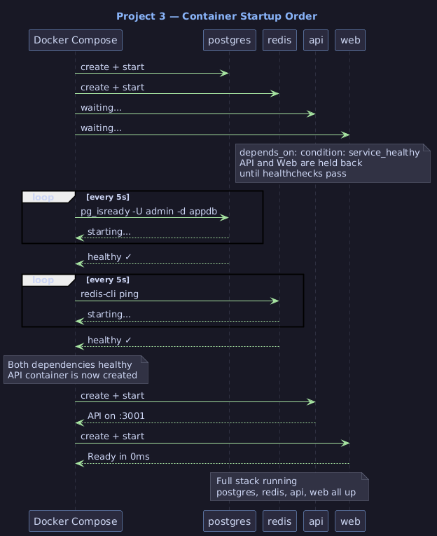
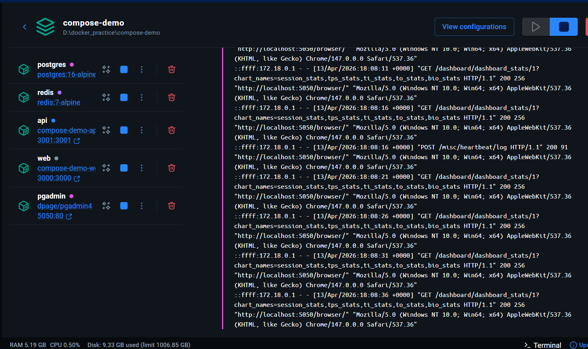

# Project 3 — Full-stack App with Docker Compose

## Motive

In Project 2 you manually ran `docker network create`, multiple `docker run` commands
with long flag lists, and had to remember the exact order to start things. That works for
3 containers. It doesn't scale.

Docker Compose solves this with a single YAML file that describes your entire stack —
services, networks, volumes, env vars, health checks, startup order — and starts
everything with one command.

But more than convenience, this project introduces two critical production concepts:

- **Healthchecks** — Docker probing a container to confirm it's actually ready, not just started
- **depends_on with service_healthy** — enforcing startup order based on health, not just
  container creation order. Without this, your API starts, tries to connect to Postgres
  which is still initializing, and crashes.

---

## What Was Built

```
┌─────────────────────────────────────────────┐
│           compose-demo stack                │
│                                             │
│  web (Next.js)     :3000                    │
│       │                                     │
│  api (Express/TS)  :3001                    │
│       │         │                           │
│  postgres        redis                      │
│       │                                     │
│  pgadmin         :5050  (dev profile only)  │
└─────────────────────────────────────────────┘
```

| Service  | Image              | Port | Purpose                        |
|----------|--------------------|------|--------------------------------|
| postgres | postgres:16-alpine | —    | Primary database               |
| redis    | redis:7-alpine     | —    | Cache layer                    |
| api      | custom build       | 3001 | Express/TS REST API            |
| web      | custom build       | 3000 | Next.js frontend               |
| pgadmin  | dpage/pgadmin4     | 5050 | DB admin UI (dev profile only) |

Postgres and Redis have no `-p` mapping — they are internal to the Compose network,
unreachable from your machine but fully accessible to other services by container name.

---

## Project Structure

```
compose-demo/
├── api/
│   ├── src/
│   │   └── index.ts
│   ├── Dockerfile
│   ├── package.json
│   └── tsconfig.json
├── web/
│   ├── app/
│   ├── Dockerfile
│   ├── next.config.ts
│   └── package.json
├── docker-compose.yml
├── .env
└── .dockerignore
```

---

## How It Works

### Networking

Compose automatically creates a network (`compose-demo_app-network`) and connects
all services to it. Same custom bridge DNS behavior as Project 2 — every service
reaches others by their service name as the hostname.

```
api connects to postgres via:  PG_HOST=postgres
api connects to redis via:     REDIS_HOST=redis
pgadmin connects to postgres:  Host = postgres (in UI)
```

### Healthchecks

Each infrastructure service defines a healthcheck — a command Docker runs inside
the container on a schedule to determine if it's truly ready:

```
Postgres healthcheck: pg_isready -U admin -d appdb
Redis healthcheck:    redis-cli ping
```

Docker tracks three states:
- `starting` — container is up but healthcheck hasn't passed yet
- `healthy` — healthcheck passed
- `unhealthy` — healthcheck failed repeatedly

### Startup Order

```
postgres ──healthcheck──► healthy ──┐
                                    ├──► api starts ──► web starts
redis    ──healthcheck──► healthy ──┘
```

`depends_on: condition: service_healthy` means the API container is not even created
until both Postgres and Redis report healthy. This eliminates the race condition where
the API crashes on startup because the database isn't ready yet.

### Named Volumes

```yaml
volumes:
  postgres_data:
  redis_data:
```

Without named volumes, all database data lives inside the container filesystem and
is wiped every `docker compose down`. Named volumes are managed by Docker and persist
independently of containers — `docker compose down` stops containers but keeps volumes.
Only `docker compose down -v` destroys them.

### Profiles

The `pgadmin` service has `profiles: ["dev"]`. It is invisible to normal
`docker compose up` and only starts when explicitly activated:

```powershell
docker compose --profile dev up -d
```

Use profiles for tools you need in development but never in production — DB admin UIs,
test runners, seed scripts, mock servers.

### Environment Variables

All credentials and config live in `.env` at the project root. Compose automatically
loads this file. Services reference variables with `${VAR_NAME}` syntax in the YAML,
or load the whole file with `env_file: .env`.

```
.env  →  docker-compose.yml  →  container environment
```

Never commit `.env` to git. Add it to `.gitignore`.

---

## Commands

### Start everything

```powershell
# Build images and start all services (attached)
docker compose up --build

# Build and start in background
docker compose up --build -d

# Start with dev profile (includes pgadmin)
docker compose --profile dev up -d
```

### Monitor

```powershell
# See all running services and their status
docker compose ps

# Stream logs from all services
docker compose logs -f

# Stream logs from one service only
docker compose logs -f api

# Watch healthcheck status
docker compose ps  # shows health column
```

### Interact

```powershell
# Shell into a running container
docker compose exec api sh
docker compose exec postgres sh

# Run a one-off command in a service container
docker compose exec postgres psql -U admin -d appdb
```

### Restart and rebuild

```powershell
# Restart one service without touching others
docker compose restart api

# Rebuild and restart one service
docker compose up -d --build api
```

### Stop and clean up

```powershell
# Stop all containers (keeps volumes and networks)
docker compose down

# Stop and remove volumes (DELETES all database data)
docker compose down -v

# Stop and remove everything including images
docker compose down -v --rmi all
```

---

## Testing the Stack

```powershell
# API health
curl http://localhost:3001/health

# Hits Postgres — returns current DB timestamp
curl http://localhost:3001/users

# Hits Redis — writes and reads a cache value
curl http://localhost:3001/cache

# Next.js frontend
# Open http://localhost:3000 in browser

# pgAdmin (dev profile only)
# Open http://localhost:5050
# Login: admin@admin.com / admin
# Connect to: host=postgres, port=5432, db=appdb, user=admin, pass=secret
```

---

## Key Concepts Learned

**Compose is Project 2 automated**
Every `docker run` flag from Project 2 maps directly to a field in `docker-compose.yml`.
`--network` → `networks`, `-e` → `environment`, `-p` → `ports`, `--name` → service name.
Understanding the manual process makes the YAML readable and debuggable.

**Healthchecks are not optional in production**
A container being "running" does not mean the process inside is ready to accept
connections. Postgres takes 1–3 seconds to initialize. Without healthchecks, dependent
services crash on startup. Always define healthchecks for databases and caches.

**depends_on without condition is nearly useless**
`depends_on: - postgres` only waits for the container to be created, not for it to be
ready. `depends_on: condition: service_healthy` waits for the healthcheck to pass.
Always use the condition form for databases.

**Named volumes outlive containers**
`docker compose down` does not delete named volumes. Your data survives restarts.
`docker compose down -v` is the nuclear option — it deletes everything. Know which
one you're running before you run it.

**Profiles keep dev tools out of production**
Services with `profiles: ["dev"]` are completely invisible to plain `docker compose up`.
The production stack and dev tooling are defined in one file but activated separately.

**env_file vs environment**
`environment:` hardcodes values in the YAML — fine for non-sensitive config.
`env_file: .env` loads from a file — use for credentials and anything that changes
between environments. Never hardcode passwords in `docker-compose.yml`.



