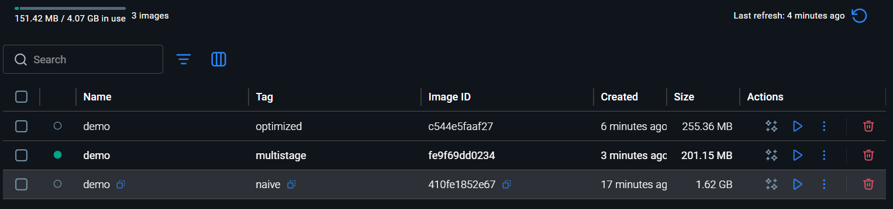

# Docker Multi-Stage Build — Project 1

## What this project covers
Understanding how Dockerfile structure directly affects image size, build cache efficiency, and security — by building the same Express/TypeScript app three different ways.

## Project structure
multi-stage-build/
├── app/
│   ├── src/index.ts
│   ├── package.json
│   ├── package-lock.json
│   └── tsconfig.json
├── dockerfiles/
│   ├── Dockerfile.naive
│   ├── Dockerfile.optimized
│   └── Dockerfile.multistage
├── .dockerignore

## The three approaches

### Naive
- Base image: `node:20` (Debian, ~950MB)
- Copies source before installing deps — busts cache on every file change
- `npm install` pulls in devDependencies (typescript, ts-node-dev, @types/*)
- Everything lands in the final image — compiler, dev tools, full OS

### Optimized
- Base image: `node:20-alpine` (~130MB)
- Copies `package*.json` first — npm install layer is cached until deps change
- `npm prune --omit=dev` removes dev tools after build
- Dev tools still exist in layer history — image carries that weight silently
### Multistage
- Stage 1 (`builder`): installs everything, compiles TypeScript → JavaScript
- Stage 2 (`runner`): fresh Alpine, prod deps only, copies `dist/` from Stage 1
- Stage 1 is completely discarded — compiler never existed in the final image
- Smallest image, cleanest layer history, smallest attack surface

## Size comparison



## Key concepts learned

**Layer caching** — Each instruction in a Dockerfile is a cached layer. COPY and RUN order determines whether Docker reuses the cache or rebuilds from scratch. Deps change less often than source code, so always copy package files before source files.

**Build context** — The folder passed at the end of `docker build ./app` is the build context. Without `.dockerignore`, your local `node_modules` gets sent to the Docker daemon unnecessarily.

**npm ci vs npm install** — `npm ci` installs exactly from `package-lock.json`, is faster, and fails loudly if the lockfile is out of sync. Always use it in Docker.

**Multistage builds** — Multiple `FROM` instructions in one Dockerfile. Each stage is independent. `COPY --from=stagename` surgically copies artifacts between stages. Anything not explicitly copied is discarded.

**EXPOSE vs -p** — `EXPOSE` is documentation only. `-p 3000:3000` in `docker run` is what actually publishes the port to your machine.

**Attached vs detached** — `docker run` locks the terminal, Ctrl+C may not stop the container. `docker run -d` runs in background, use `docker stop <name>` to stop it.

## Commands

```powershell
# Build
docker build -f dockerfiles/Dockerfile.naive      -t demo:naive      ./app
docker build -f dockerfiles/Dockerfile.optimized  -t demo:optimized  ./app
docker build -f dockerfiles/Dockerfile.multistage -t demo:multistage ./app

# Compare sizes
docker images | Select-String "demo"

# Run
docker run -d -p 3000:3000 --name my-app demo:multistage

# Test
curl http://localhost:3000
curl http://localhost:3000/health

# Cleanup
docker stop my-app
docker rm my-app
docker image rm demo:naive demo:optimized demo:multistage
```
